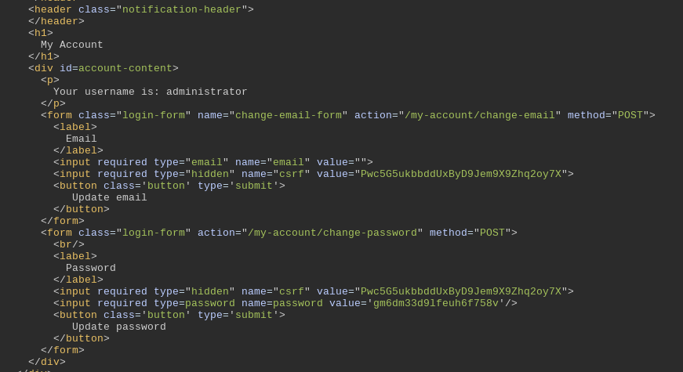

# 🧪 Lab PortSwigger – IDOR avec escalade horizontale et verticale

## 🎯 Objectif

Exploiter une faille d'authentification par id pour faire une escalation horizontale afin d'aboutir à une escalation verticale et gagner accès au panneau admin pour supprimer un utilisateur (Carlos).

---

## 🧩 Contexte

- Fonctionnalité observée : C'est une application de vente qui gère des utilisteurs et disposant d'un panneau administrateur.
- URL ou requête initiale :

```
GET /my-account?id=administrator HTTP/1.1
Cookie: session=ES1obJccdsFHKIBuEdqOvXMayy0PrWQ4

```

---

## 🛠️ Étapes / Tentatives

1. Interception de la requête avec Burp Suite.
2. Connexion avec les identifiants wiener:peter
3. Identification du paramètre sur la page de gestion du compte `id=wiener`.
4. Modification la valeur → `id=admin` qui échoua puis `id=administrator` qui a réussi .
5. Observation la réponse la réponse : présence du mot de passe admin dans le code source de la page.
6. Connexion au compte admin et suppression de l'user Carlos

---

## ✅ Solution trouvée

La vulnérabilité est un **Horizontal and vertical escalation**.
En changeant l’ID, il est possible d’accéder aux données d’un autre utilisateur.

---

## 📸 Captures d’écran



On y observe le password admin sur la ligne

```html
<input required type="password" name="password" value="gm6dm33d9lfeuh6f758v" />
```

On a donc comme solution:

- username = `administrator`
- password = `gm6dm33d9lfeuh6f758v`

## 📝 Leçon apprise

- Tester systématiquement les paramètres visibles (URL, cookies, POST).
- Mettre en place des contrôles d’accès côté serveur.
- Ce type de faille reste courant dans les applications web.

---

## 🔒 Remédiation

- Contrôles d’accès côté serveur
- Requêtes préparées
- Ne jamais exposer les mots de passe en clair dans le HTML
- Implémenter une gestion stricte des rôles et permissions
