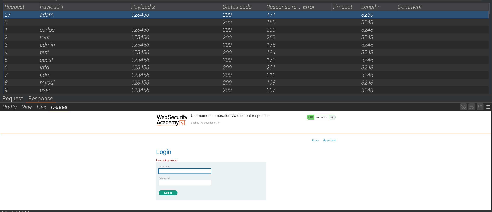
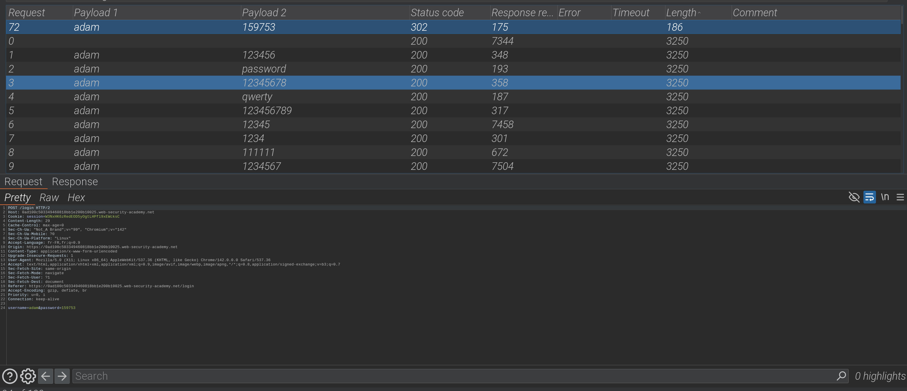

# 🧪 Lab PortSwigger – Login par bruteforce

## 🎯 Objectif

Exploiter une faiblesse dans le mécanisme d’authentification pour identifier des utilisateurs valides et obtenir leurs identifiants via une attaque par brute‑force.

---

## 🧩 Contexte

- Fonctionnalité observée : formulaire de connexion.
- Problème : l’application indique si c’est le **username** ou le **password** qui est incorrect, et ne limite pas le nombre de tentatives.
- Cela ouvre la porte à une attaque de type **username enumeration + brute‑force**.

Requête initiale interceptée :

```http
POST /login HTTP/1.1
Host: 0ad100c503349460818bb1e200b10025.web-security-academy.net
Cookie: session=W3NxHK6zRedEOD5yOgtLHPfl9xEWcksC
username=test&password=test
```

---

## 🚀 Proof of Concept (PoC)

1. Interception de la requête avec Burp Suite.
2. Lancement d’une attaque **Cluster Bomb** sur les paramètres `username` et `password`.
3. Filtrage des réponses → une requête différente indiquait _“mot de passe incorrect”_.  
   → Cela prouve que l’utilisateur `adam` existe.
4. Lancement d’une attaque ciblée sur `adam` avec une wordlist de mots de passe.
5. Résultat : mot de passe trouvé = `159753`.

---

## ✅ Credentials obtenus

- **Username** : `adam`
- **Password** : `159753`

---

## ⚠️ Impact

- Un attaquant peut identifier les utilisateurs valides de l’application.
- Une fois un username trouvé, il peut brute‑forcer le mot de passe sans restriction.
- Cela entraîne une **compromission totale du compte** et peut servir de point d’entrée pour attaquer d’autres fonctionnalités sensibles.

Gravité estimée : **Haute (CVSS ~8.8)**.

---

## 📸 Preuves

- Capture d’écran montrant la réponse différente pour `adam`.



- Capture d’écran montrant la connexion réussie avec `adam:159753`.



---

## 🔒 Remédiation

- Implémenter une **politique de verrouillage** après plusieurs tentatives échouées.
- Ajouter une **limitation de débit (rate limiting)** sur les tentatives de login.
- Uniformiser les messages d’erreur → ne pas indiquer si c’est le username ou le mot de passe qui est incorrect.
- Mettre en place une authentification forte (MFA).

---

## 📌 Résumé

- **Vulnérabilité :** Username enumeration + brute‑force
- **Impact :** Compromission de comptes utilisateurs valides
- **Gravité :** Haute
- **Outils utilisés :** Burp Suite (Intruder)
- **Niveau de difficulté :** ⭐⭐✩✩✩

---
